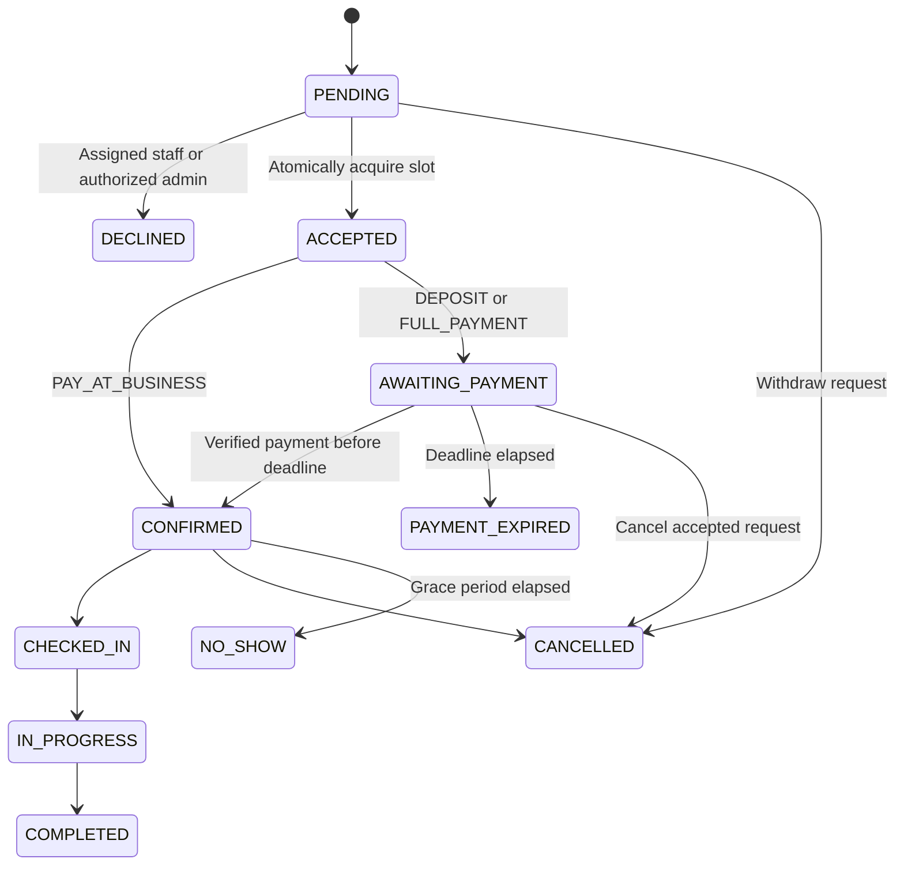

# Appointment Business System

## Phase 6 application status

The advisory availability engine is implemented at `/api/availability` through `public.availability_for_date`, using the existing business-local hours, staff hours, service eligibility, closures, staff exceptions, booking policy, configured slot interval and occupied appointment ranges. It reports eligible staff and recommends least-loaded for that local date, then lowest staff UUID as a stable tie-break. This does not reserve time. `private.request_appointment` now also checks the current business slot grid, and acceptance remains the atomic reservation point protected by the lock and GiST exclusion constraint. `/admin/availability` adds live MFA-gated diagnostics. API results are uncached; distributed rate limiting must be configured at the deployment edge. See `docs/operations/phase-6-report.md` and `docs/deployment/availability-engine.md`.

The connected Supabase project has not received Phase 5 or 6 migrations yet. Reconcile the previously reported migration history before deployment.

## Phase 7 application status

The public business website and customer booking flow are implemented using a safe database projection and the Phase 6 availability engine. `/book` supports registered customers and configurable guest booking, Any Available Staff, business-local dates, availability-backed times, review, and PENDING request submission. PostgreSQL revalidates each request under the schedule lock, derives service/payment snapshots, creates the event, and keeps PENDING non-blocking. Guest viewing requires an expiring token whose hash is stored in PostgreSQL and whose secret is held in an HttpOnly cookie; UUIDs alone do not grant access. `/account` and customer appointment detail/list routes show only the signed-in customer's data. Guest recovery and transactional booking/payment email use the server-only Resend layer and durable notification outbox; details are in `docs/deployment/email-architecture.md`.

## Phase 4 application status

The admin shell now contains database-backed dashboard cards and schedule/request/activity sections, business and versioned booking settings, split weekly hours, closures and announcements. Appointment/customer detail pages, daily calendar, payment history and currency-separated lifetime reports are read-only. No booking/state mutation controls or payment gateway were added.

All reads pass through a server admin guard and a SECURITY INVOKER aggregation RPC that rechecks live admin/MFA authorization and preserves table RLS. Configuration mutations reuse RLS and the existing schedule lock. New fields extend business_settings; no tenant model or replacement settings store was added. Booking-rule changes append immutable policy versions. Timezone/currency remain locked after the first appointment.

Weekly hours replacement is atomic. Its existing schedule-protection trigger now checks the final transaction state through a deferred constraint trigger; direct table writes are still checked at commit. A GiST exclusion constraint rejects overlapping weekly intervals. Closure conversions reject ambiguous/nonexistent local wall times. The appointment GiST constraint, lifecycle guards and financial operations are unchanged.

The registration toggle is checked by the signup action and a private deferred Auth-user insert trigger. This trigger reads the final stored invited_at, allowing trusted Auth invitations while rejecting new self-registration when disabled. It never trusts user metadata. Verify this integration against managed Auth before launch. Scheduling interval and default buffer are configuration defaults for future slot/service interfaces, not overrides of existing service or appointment snapshots. Guest booking remains a future backend feature.

See `docs/operations/phase-4-report.md` and `docs/deployment/admin-configuration.md`. Phase 2/3 status notes below are historical milestones.

## Phase 3 application status

Authentication and protected application shells now implement this architecture. Login redirects prioritize OWNER/ADMIN (MFA required), then active STAFF, then CUSTOMER. Every protected page/action checks the verified session and live roles independently. Profile disabling and inactive staff links fail closed. Editable metadata is only validated display/contact input.

Customer signup cannot grant privileged roles. The new account helper provisions only the authenticated customer's record and never claims guest records by matching email. OWNER-only role assignment is preserved: ADMIN can view the staff shell but only OWNER with MFA may invite/link STAFF. A one-time service-only CLI bootstraps the initial verified owner.

Login, registration, logout, email verification/resend, password recovery/reset, PKCE callback and TOTP setup/challenge are implemented. `/admin`, `/staff` and `/account` have the planned navigation and safe future-feature placeholders. Customer profile editing and owner staff-account invitation/linking are functional. All other full business modules remain deferred. See `docs/deployment/authentication-setup.md` for configuration and `docs/operations/phase-3-report.md` for implementation details. Phase 2-only status notes below describe the earlier milestone.

## Deployment model

One reusable, versioned upstream codebase is maintained by the system owner. Every business receives a separate Next.js/Vercel project, Supabase project/database/Auth/Storage, domain, environment configuration, assets and operational settings. There is no tenant discriminator, shared business database, subscription platform or website builder. Releases and migrations are rolled out independently to each installation.

Initial boundaries: one location, IANA timezone and currency per installation; one staff member and one service per appointment. Appointment items retain an extensible line-item model, with a unique appointment constraint enforcing the initial one-service limit. Multiple services, locations, resource/group capacity and payroll are future extensions.

## Modular monolith

Next.js App Router, React, TypeScript and Tailwind provide the presentation layer. Server Components perform initial reads; Client Components provide later interactive forms/calendars. Routes and future Server Actions call feature application services. Domain policy and validation stay in feature modules. Supabase clients, notification/payment adapters and job helpers stay in infrastructure modules.

PostgreSQL is the authority for ownership, immutable booking snapshots, appointment transitions and time reservation. Public RPC wrappers use SECURITY INVOKER. Narrow private SECURITY DEFINER functions perform authorized transactional writes; they use an empty search path, qualified identifiers and explicit EXECUTE grants. The private schema must never be exposed through the Data API.

## Actors and access

| Actor | Scope |
| --- | --- |
| Owner/admin | Operational management; MFA (`aal2`) required; only owner grants/removes privileged roles |
| Staff | Assigned appointments, own schedule, permitted transitions/notes and necessary customer contact information |
| Registered customer | Own profile, customer record, appointments, customer-visible notes, payments and refunds |
| Guest/public | Explicitly published business, service and safe staff data; no direct protected-table access |

`user_roles` contains OWNER, ADMIN and STAFF. CUSTOMER is ownership of a customer record, not a privileged role. A staff/admin account may also own a customer record. Auth user creation makes a profile but grants no role and does not claim guest customer records. Editable user metadata is not used for authorization. Role checks read live database records and reject disabled profiles. Public staff reads use column grants that exclude `auth_user_id`; explicitly select safe fields, not `*`.

Guest booking uses a narrowly scoped database operation that verifies the business guest-booking setting and creates a guest customer without an Auth user. The database generates a cryptographically random token, stores only its SHA-256 hash with a 30-day expiry, and returns the token only to the requester; the application keeps it in an HttpOnly cookie. A narrow token lookup returns only the matching customer-safe booking summary. UUID-only guest access remains denied. The booking server action uses a best-effort in-process write limiter; a shared edge limit is still required in production.

## Authoritative lifecycle: staff approval before payment



There is no default instant booking mode. Requests cannot skip acceptance. `ACCEPTED` is logged as a real transition but must resolve to CONFIRMED or AWAITING_PAYMENT in the same transaction. A deferred constraint trigger rejects transactions leaving it stalled. Terminal states cannot be reopened through generic updates. Rescheduling is reserved for a future dedicated atomic operation, not a status.

Acceptance rechecks active staff/service eligibility, notice window, working hours and closures. It preserves the requested service name, price, duration, buffers, currency, required payment amount and immutable policy version. Configuration changes never silently reprice requests. The acceptance actor/time, decline details and payment deadline/expiration are stored explicitly.

## Slot reservation

| State | Blocks occupied staff interval? |
| --- | --- |
| PENDING | No; competing requests are allowed |
| ACCEPTED | Yes, inside the acceptance transaction |
| AWAITING_PAYMENT | Yes, until explicitly transitioned to PAYMENT_EXPIRED or CANCELLED |
| CONFIRMED / CHECKED_IN / IN_PROGRESS | Yes |
| COMPLETED / NO_SHOW | Yes, preserving historical occupied intervals |
| DECLINED / PAYMENT_EXPIRED / CANCELLED | No |

The customer interface must explain that submission is a request, not a reservation. A losing competing request remains PENDING and cannot pay; staff must decline it or arrange a different time.

`occupied_range` is computed by a database trigger as `[starts_at - before_buffer, ends_at + after_buffer)`. A partial GiST exclusion constraint compares staff UUID equality and range overlap. Half-open ranges permit exact adjacency. Pending records are excluded from the constraint; accepting one acquires the reservation atomically. A conflicting acceptance rolls back completely, including audit/outbox events.

A transaction-scoped advisory lock serializes schedule writes, requests, acceptance, payment verification and expiry for this single business. Statement triggers acquire it before row locks. Hours/closure changes revalidate existing active reservations and reject invalidation; the business must resolve affected appointments first. This is deliberately coarse and safe for the initial business scale. Optimize only after measuring contention.

Deadline expiry is an explicit state update, never a `now()` predicate in an index. Requests and acceptance expire overdue reservations opportunistically. A service-only expiry RPC is ready for a periodic job. A failed enclosing transaction also rolls back its opportunistic cleanup; the independent expiry job remains required. Availability omits a payment reservation after its deadline and returns only safe advisory results; request and acceptance operations perform transactional expiry and final validation.

Weekly hours are local to the business timezone; appointments and date-specific exceptions use timestamptz. EXTRA_HOURS supplement staff hours within business opening hours; UNAVAILABLE and closures take precedence. Intervals, including buffers, must fit within a single local calendar day in Phase 2. Multi-day and DST-specific booking UI behavior require later implementation.

## Database relationships

Auth users have profiles, optional role assignments, an optional customer identity and an optional staff identity. Customers and staff each have many appointments. Services connect to staff through staff_services. Appointments reference immutable policy versions and own service snapshot items, transition events, scoped notes, guest tokens and payments. Payments have refunds and deduplicated provider events. Outbox entries and audit logs preserve operational evidence.

All 25 requested tables are implemented:

- Business/content: business_settings, booking_policy_versions, website_settings, announcements.
- Identity/catalog: profiles, user_roles, customers, staff, service_categories, services, staff_services.
- Scheduling: business_hours, staff_working_hours, staff_schedule_exceptions, business_closures.
- Appointments: appointments, appointment_items, appointment_events, appointment_notes, guest_access_tokens.
- Finance/operations: payments, refunds, payment_events, notification_outbox, audit_logs.

Every table has a UUID primary key, created_at, updated_at and RLS. Financial amounts are integer minor units constrained to JavaScript's safe integer range. Foreign keys restrict deletion of referenced business history. Policy versions, appointment items, events and audit logs are immutable. UTC instants and IANA timezone settings replace server-local time assumptions. Changing the operating currency/timezone after bookings exist requires an explicit data migration.

## Payment architecture

Appointment, payment and refund enums are independent. PAY_AT_BUSINESS confirms an accepted appointment without marking it paid. DEPOSIT/FULL_PAYMENT enters AWAITING_PAYMENT and sets a bounded deadline, never later than the appointment start.

Creating a pending payment record requires acceptance; an awaiting-payment attempt must equal the required outstanding deposit/full amount. Only one PENDING attempt exists per appointment. Collected funds cannot exceed the appointment total through normal attempts. Payment facts are server-only; a future adapter must validate the provider signature, merchant/account, reference, amount, currency and timestamp before calling `record_verified_payment`. The RPC does not verify external signatures itself.

Provider events are unique by provider/event ID. Successful payments are immutable, and repeat delivery is idempotent. A verified payment confirms only a live reservation before its deadline. A late payment after expiry/cancellation records the money, adds a payment exception and durable notification, and never resurrects the appointment. Automatic reacquisition/refund is deferred to gateway integration: the safe Phase 2 fallback is manual reconciliation. Pending and successful refunds reserve refundable balance under a lock, preventing excess refunds. No funds move in this phase.

The outbox is written in the same transaction as appointment state changes. A Vercel Cron route leases and dispatches jobs after commit through the server-only Resend API client, with idempotency keys, safe error categories, bounded retries and no rollback of booking/payment facts. Supabase Auth continues to own confirmation, recovery and invite tokens; configure its SMTP separately as documented in `docs/deployment/email-architecture.md`. Reports must distinguish cash receipts, deposits, service revenue, refunds and outstanding balances.

## Major routes

Implemented public routes: `/`, `/services`, `/services/[slug]`, `/team`, `/team/[slug]`, `/about`, `/contact`, `/book`, `/book/confirmation`, `/booking/manage`. Published announcements appear on the home page. Dedicated announcement and policy pages remain planned.

Auth routes: `/login`, `/register`, `/forgot-password`, `/reset-password`, `/auth/callback`.

Customer routes: `/account`, `/account/profile`, `/account/appointments`, `/account/appointments/[id]`, `/account/payments`.

Staff routes: `/staff`, `/staff/calendar`, `/staff/appointments/[id]`, `/staff/availability`, `/staff/profile`.

Admin routes: `/admin`, `/admin/calendar`, `/admin/appointments`, `/admin/appointments/[id]`, `/admin/customers`, `/admin/customers/[id]`, `/admin/services`, `/admin/staff`, `/admin/payments`, `/admin/refunds`, `/admin/reports`, `/admin/availability`, `/admin/closures`, `/admin/announcements`, `/admin/appearance`, `/admin/settings`, `/admin/audit-log`.

Implemented public interfaces: `/api/availability` and the `/book` server action. Future APIs: `/api/webhooks/payments/[provider]`, `/api/jobs/[job]`.

## Folder ownership

```text
src/app/                 Route groups, layouts, future API boundaries
src/features/            Feature services, domain rules, schemas, components
src/components/          Shared UI/layout/form components
src/lib/auth/            Verified server identity
src/lib/supabase/        Browser, cookie server, privileged server clients
src/lib/payments/        Provider contracts and future adapters
src/lib/{jobs,notifications,observability,validation,time,money}/
src/config/              Validated environment and system defaults
src/types/               Migration-derived database types
supabase/migrations/     Ordered, versioned schema and policy changes
supabase/tests/          Future managed-Supabase SQL tests
scripts/                 Embedded PostgreSQL tests and offline type generator
tests/{unit,integration,e2e}/
docs/{architecture,deployment,operations}/
```

## Security principles and operational boundary

RLS is enabled on every exposed table. Routine clients retain user credentials; the secret-key client is isolated with `server-only`, disables session persistence, and is unused by customer/staff application services. Direct appointment/payment mutations are not granted to authenticated users, including admins. Owner/admin permissions are live role checks with MFA. Public catalog fields contain no secrets. Guest hashes, provider payloads and outbox records have no browser access.

Proxy refreshes cookies but never substitutes for authorization. Protected actions verify identity and rely on database permissions again. Private responses are not shared-cacheable. Every future endpoint needs input validation, bounded requests, authorization and appropriate CSRF/origin protection. Public content sanitization, upload type/size enforcement and storage policies must precede those interfaces. No Storage bucket is opened by these migrations.

Before production: verify RLS against managed Supabase, real concurrent sessions and payment retries; configure Auth redirects, SMTP, MFA and rate limiting; implement job delivery/reconciliation; test backups/restores and asset recovery; add monitoring, retention and deletion/pseudonymization workflows. Existing restrictive history foreign keys intentionally prevent casual destructive deletion.

## Documentation references checked during implementation

- [Supabase SSR clients](https://supabase.com/docs/guides/auth/server-side/creating-a-client)
- [Supabase RLS](https://supabase.com/docs/guides/database/postgres/row-level-security)
- [Next.js data security](https://nextjs.org/docs/app/guides/data-security)
- [PostgreSQL range constraints](https://www.postgresql.org/docs/current/rangetypes.html)
- [Supabase changelog](https://supabase.com/changelog): the September 2026 btree_gist float/NaN reindex notice does not affect this new UUID/range constraint.

